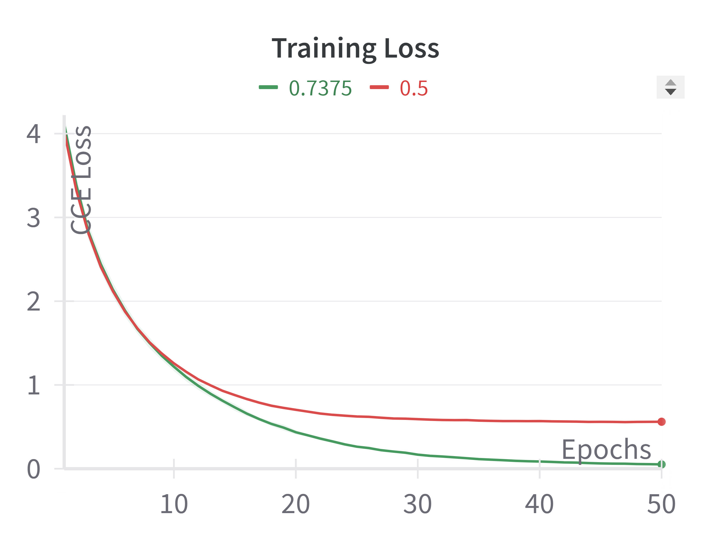
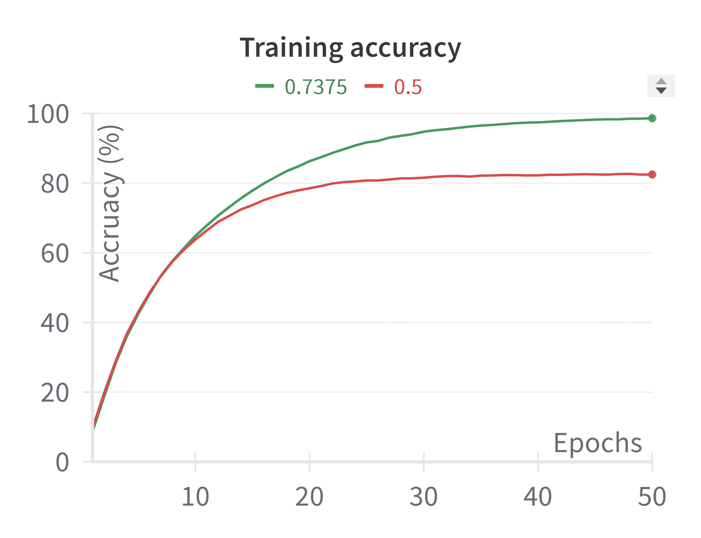
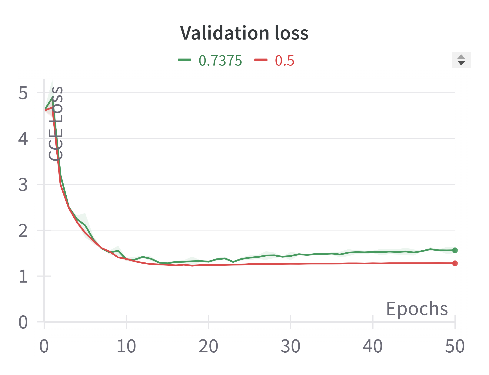
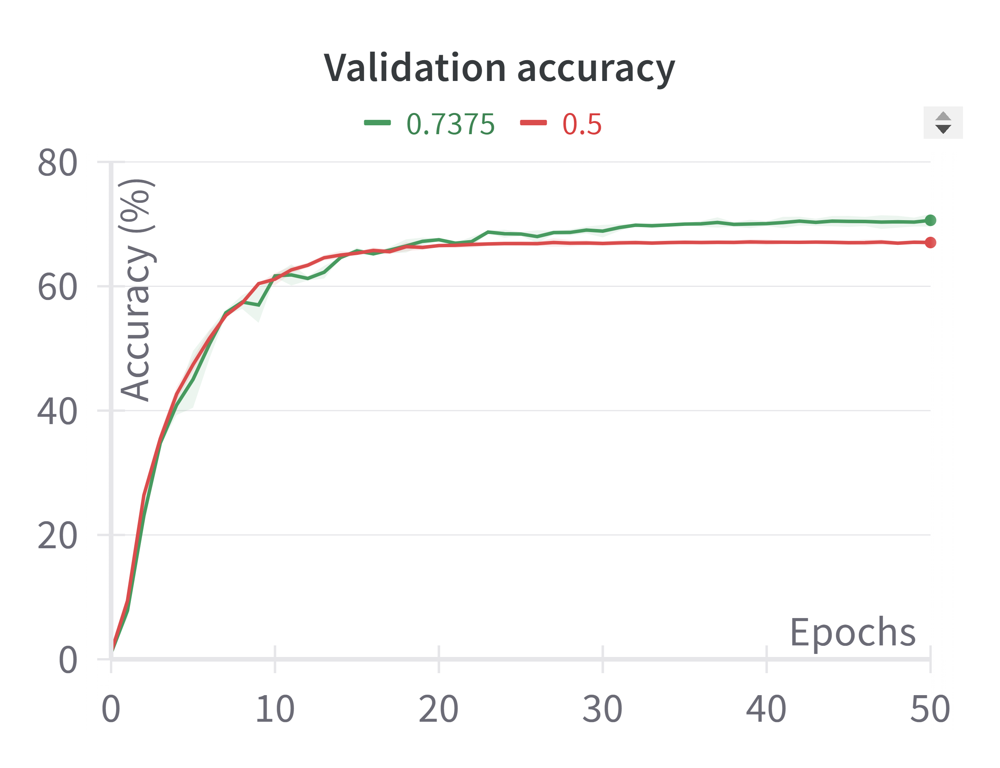
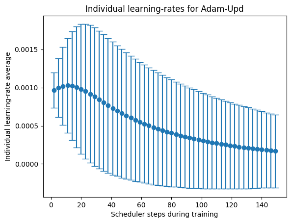
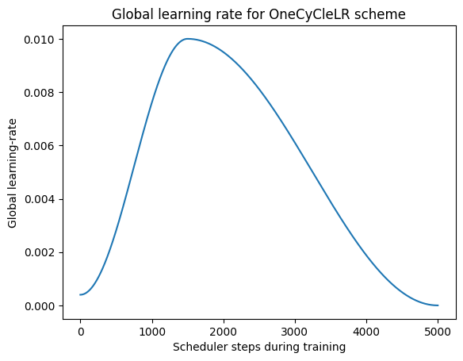
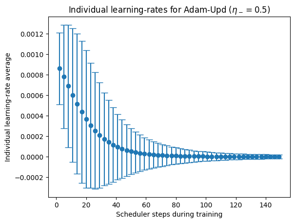

# **L-algorithms: Decoupling L and M mini-batches for adaptive learning-rates**

**Søren Holst Andersen**  
June-August 2024

## Introduction

The results presented in the paper [*Expanding an adaptive learning-rate algorithm to handle mini-batch training*](http://lup.lub.lu.se/student-papers/record/9166149) show that the S-Rprop algorithm competes with SGD on the MNIST dataset with identical architecture and an optimized learning rate, while it outperforms SGD in a deep-learning setting.  
The current goals are to:

- implement Rprop's adaptive learning-rate scheme to other mini-batch algorithms (SGD and Adam) in order to assess if S-Rprop is the best mini-batch algorithm of its kind (or if improved variations exist),
- test S-Rprop against more state-of-the-art algorithms in mini-batch training such as [Adam](https://arxiv.org/abs/1412.6980);
- scale up testing with larger and more complex datasets;
- go beyond training and use a validation dataset to make a better assessment of S-Rprop's results for applications.

## Implementing Adaptive Learning-Rate Scheme for SGD & Adam

The SGD and Adam algorithms, available as open-source code from the [PyTorch website](https://pytorch.org/docs/stable/optim.html), were modified to make use of the adaptive learning-rate scheme explained in [Andersen, 2024]. These are available in the Custom Optimizers folder as SGDUpd and AdamUpd, alongside S-Rprop.

## Benchmarking New Algorithms

These new algorithms, called *SGD-updated* and *Adam-updated* (names can be improved later), were tested on the MNIST dataset using the CNN architecture from [Andersen, 2024]. The learning rate, $L$ and $M$ hyper-parameters were optimized for each algorithm.

### Hyper-parameter Optimization

For all algorithms a wandb [sweep](https://docs.wandb.ai/guides/sweeps) was performed with the Bayesian optimization method (see sweep.py for code). Sweeps allow for an intuitive and insightful representation of hyper-parameter relationships. For some algorithms, this revealed clear preferences in terms of hyper-paramter combinations, and this was followed up by a grid-search over a smaller area. For others, Bayesian optimization did not explore the entire parameter space (this method scales poorly) and thus a grid-search was used over a larger area (see benchmark.py for code).
During the grid-search, 5 runs were made for each hyper-parameter combination and the loss mean of each point was used to find optimal hyper-parameters giving minimal loss.

The grid-search values were:
- `SGD+M`, `lr = [0.0001, 0.001, 0.01, 0.1], M = [5, 25, 100]`.
- `SGD-Upd`, `lr = [0.01, 0.1], L = [3000, 6000, 15000], M = [5, 25, 100, 500]`.
- `Adam-Upd`, `lr = [0.0001, 0.001, 0.01], L = [3000, 6000, 15000], M = [5, 25, 100, 500]`.
- `Adam`, `lr = [0.0001, 0.001, 0.01], M = [5, 25, 100, 500]`.

In Table 1, the S-Rprop and vanilla SGD results are taken from the S-Rprop paper (2024).

| Algorithm  | Best H-P pair $(L, M, Lr)$  | Min Loss $\mu$   | S.D. $\sigma$ | Min. Loss Epoch  |
|------------|-----------------------------|------------------|---------------|------------------|
| S-Rprop    | $30000, 600, 10^{-3}$       | $0.025$          | $0.003$       |                  |
| SGD        | $N/A, 5, 10^{-3}$           | $0.027$          | $0.005$       |                  |
| SGD+M      | $N/A, 25, 10^{-2}$          | $0.013$          | $0.001$       | $5$              |
| SGD-Upd    | $15000, 25, 10^{-1}$        | $0.008$          | $0.001$       | $5$              |
| Adam       | $N/A, 25, 10^{-3}$          | $0.013$          | $0.001$       | $4$              |
| Adam-Upd   | $15000, 5, 10^{-3}$         | $\mathbf{0.004}$ | $0.000$       | $5$              |

*Table 1: Best runs for each optimizer. Mean is presented with standard deviation for 5 runs and the epoch at which minimum loss was reached. 5 epochs of training was used with the MNIST dataset.*

The following are plots of the runs presented in Table 1. On the left is the progression of loss over the entire 5 epochs of training. On the right is a narrowed window showing 4-5 epochs where all algorithms reach their respective values of minimal loss. The S-Rprop and SGD results have been left as they do not reach the same performance level as these algorithms.

  
   

### Learning-rate scheduling
SGD+M and Adam were then also trained with a Cosine Annealing LR scheduler with 5 steps, one taken every epoch.
These were evaluated with a grid-search using the same grid-searches as above, for vanilla Adam & SGD+M respsectively.

| Algorithm  | Best H-P pair $(L, M, Lr)$  | Min Loss $\mu$   | S.D. $\sigma$ | Min. Loss Epoch  |
|------------|-----------------------------|------------------|---------------|------------------|
| Adam-Sch   | $N/A, 5, 10^{-3}$           | $\mathbf{0.003}$ | $0.000$       | $5$              |
| SGD+M-Sch  | $N/A, 25, 10^{-2}$          | $0.005$          | $0.001$       | $5$              |

*Table 2: Best runs for each optimizer. Mean and standard deviation calculated as in Table 1, with same architecture and training time.*

The training progress for these runs occured at an almost identical pace to the results in Table 1, as shown in Figure 1.

## Validating models
The optimal set of hyper-parameters was taken for each optimization method in Table 1 and Table 2 above, and each model was validated on the MNIST validation dataset of 10,000 patterns after every 3,000 patterns were used for training.

  
   

S-Rprop has slower learning due to its large mini-batch size slowing down training.

## Larger dataset: CIFAR-100 with ResNet9

All the performances above give an accuracy of 98-99% and therefore MNIST is too simple of a dataset to properly evaluate the differences between the different algorithms. We thus use [CIFAR-100](https://www.cs.toronto.edu/~kriz/cifar.html) instead, which consists of 50000 training images, each pertaining to 1 of 100 classes with 500 images per class, and 10000 images for validation.
The image sizes are 32x32x3 (RGB). A standard data augmentation scheme was used where each image is flipped horizontally with a probability of 50%, and each image is reflection padded with 4 pixels and randomly resized back to 32x32 (see CIFAR.py).

It was first attempted to reproduce the results in Figure 4 of the paper [The Road Less Scheduled](https://arxiv.org/abs/2405.15682) which uses a variation of DenseNet121 to reach 79% validation accuracy. The DenseNet used to attempt to reproduce this result is provided in the Custom_Optimizers folder, densetnet.py. The suspected reason for this is the kernel size for the pre-processing convolutional layer is 7x7, which is made for ImageNet, and likely too large for CIFAR 32x32 images. The code was run with bn_size=1 which removes bottleneck layers and the code was edited to change the compression factor from 0.5 to 1, removing compression. This is equivalent to DenseNet as opposed to DenseNet-BC (see [Densely Connected Convolutional Networks](https://arxiv.org/abs/1608.06993).

We moved on to a simpler architecture: ResNet9 (Residual Network with 9 layers). The code is provided in resnet9.py and a visualisation of the architecture is in the images folder.

### Algorithm additions

Weight decay and momentum functionalities were added to the SGD-Upd algorithm and weight decay was added to the S-Rprop algorithm in order to better evaluate these on validation datasets.

### Potential for optimization: $\eta^-$ and $\eta^+$

For algorithms with the Rprop learning-rate update scheme, hyper-parameters were changed to 
$\eta^{-} = 0.7375, \eta^{+} = 1.2, \Delta_{min} = 10^{-6}, \Delta_{max} = 10^{-2}$ following best values found for a wide range of problems in [this paper by Eckohoff & Reiher (2023)](https://www.researchgate.net/publication/377486837_CoRe_Optimizer_An_All-in-One_Solution_for_Machine_Learning).
The effect of these changes can be seen in the following plots:

  
   

  
   

The line denoted `0.7375` refers to the updated hyper-parameters, `0.5` refers to the hyper-parameters used in the thesis paper for the MNIST dataset. The training loss and training accuracy improve drastically, with accuracy jumping from 82 to 99. The validation accuracy also improves from 67% to 71% while the validation loss degrades. These runs are made with `learning-rate = 10^{-3}, M-minibatch = 500, L-minibatch = 25000, dropout_rate = 0.2, weight_decay = 10^{-4}, grad_clip = False`. On the surface, the effect of using grad_clip does not appear to change the performance of the model, but does make its result more accurate after repeated runs and thus less susceptible to initial conditions.

These plots show that $\eta^{-}, \eta^{+}, \Delta_{min}, \Delta_{max}$ could be further optimized on the dataset. Of these hyper-parameters, we expect the $\eta^{-}, \eta^{+}$ pair to have the larger impact on model performance.

### Testing

The [best run with Adam](https://jovian.com/tessdja/resnet-practice-cifar100-resnet) using gradient clippping, weight decay and a OneCycleLR schedule gives 74% validation accuracy, which is taken as the performance benchmark of ResNet9 for this dataset. This result was reproduced, and Adam-Upd was tested with gradient clipping and weight-decay and a grid-search of `learning-rate = [0.0001, 0.001]`, `M minibatch = [500]`, `L-minibatch=[25000, 50000]`. Training lasted 50 epochs in all cases. 2 runs were made per hyper-parameter combination.

| Algorithm  | Best H-P pair $(L, M, Lr)$  | Max Training Accuracy (%)  | Max Val Accuracy (%) | Epoch (Tr, Val)  |
|------------|-----------------------------|----------------------------|----------------------|------------------|
| Adam-OneCycleLR   | $N/A, 500, 10^{-2}$       | $97$          | $\mathbf{74}$  | $45, 48$  |
| Adam-Upd          | $25000, 500, 10^{-3}$     | $\mathbf{99}$ | $71$           | $48, 50$  |
| Adam              | $N/A, 500, 10^{-3}$       | $93$          | $68$           | $46, 49$  |
| SGD+M             | $N/A, 25, 10^{-2}$        | x       | x        | x       |
| SGD+M-Upd  | $N/A, 25, 10^{-2}$          | x          | x       | x              |
| SGD-Upd  | $N/A, 25, 10^{-2}$          | x          | x       | x              |
| S-Rprop  | $N/A, 25, 10^{-2}$          | x          | x       | x             |

In order to see these results in the wandb project called CIFAR-100, I recommend grouping the runs by optimizer --> schedule --> learning_rate --> minibatch_size --> lr_batch_size --> eta_m --> grad_clip --> weight_decay.

*Table 3: Best runs for different optimizers using Resnet9 and CIFAR-100.*

### Learning-rate tracking
A learning-rate tracking functionality was added to the custom optimizers using optimizer class attributes `lr_mean` and `lr_std` which are calculated at every iteration of L minibatches, and the iteration of L minibatches is tracked using attribute `lr_counter`. This enables plotting of the learning-rate mean and standard deviation throughout training. It is activated with an argument: `track_lr=True` when declaring the optimizer. Unfortunately the standard deviation cannot be automatically added as the standard deviation for the mean plot in wandb. Therefore we do this manually by exporting raw data from wandb as a CSV file and plotting mean with standard deviation in a separate py document called LR_plotting.py.

  
  

These plots show the evolution of the learning rate mean for Adam with OneCycleLR schedule (which has the best validation performance in *Table 3*), and Adam-Upd with the old hyper-parameters for $\eta^{-}, \eta^{+}, \Delta_{min}, \Delta_{max}$ as well as with the newer ones. The data for AdamUpd where $\eta^{-}=0.7375$ was one of the two runs with the optimal hyper-parameter combination from *Table 3*. The data for the last plot with the old $\eta^{-}, \eta^{+}, \Delta_{min}, \Delta_{max}$ values (labeled $\eta^{-}=0.5$, gave a training accuracy of 83%, and validation accuracy 67%. The errorbars are the standard deviations. There are none for the OneCycleLR schedule as this has a globally updated learning rate.

We see that the Rprop learning-rate update scheme can automatically take on the role of a learning-rate scheduler. Changing $\eta^{-}, \eta^{+}$ changes this schedule, and in the plots provided, one can see that when the LR-mean behaviour resembles the OneCycleLR schedule, performance improves.

### Going deeper
- As per this [paper by Mosca & Magoulas (2015)](https://arxiv.org/abs/1509.04612), Rprop training is delayed when used with the Dropout regularization method. It is not obvious if this problem would persist when using the L-minibatch approximation described in Andersen (2024). If the problem does persist, implementing information of the Dropout mask as in Mosca & Magoulas may accelerate learning and improve overall performance.
